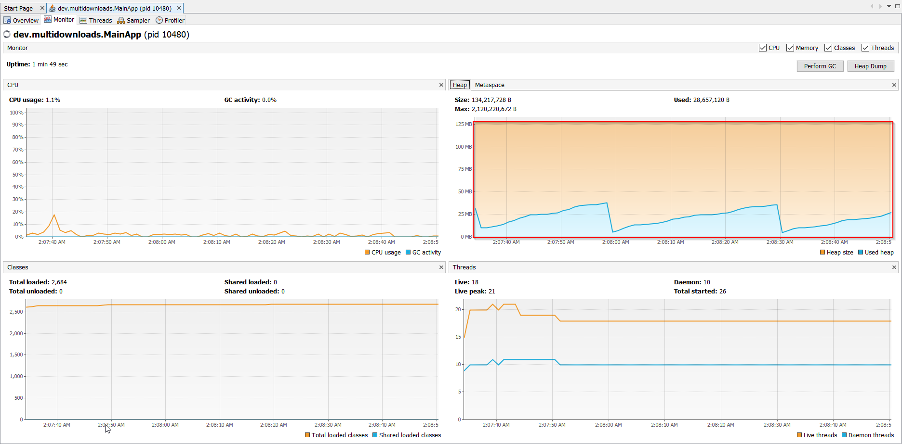
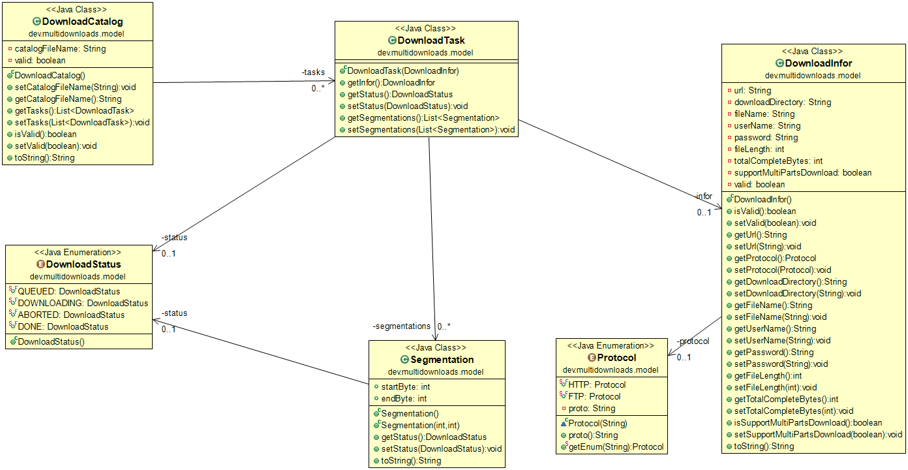
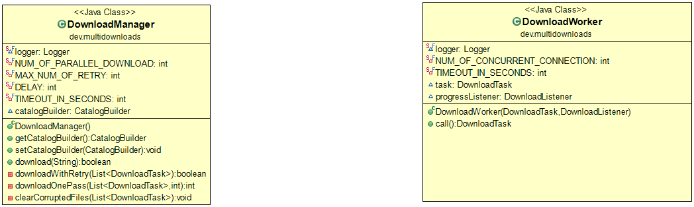
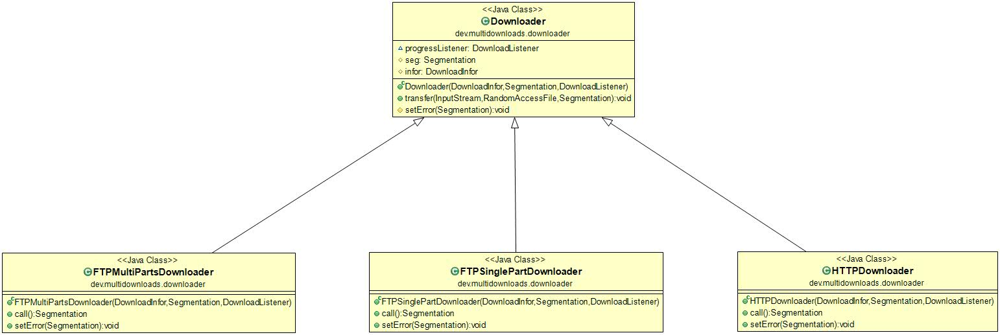
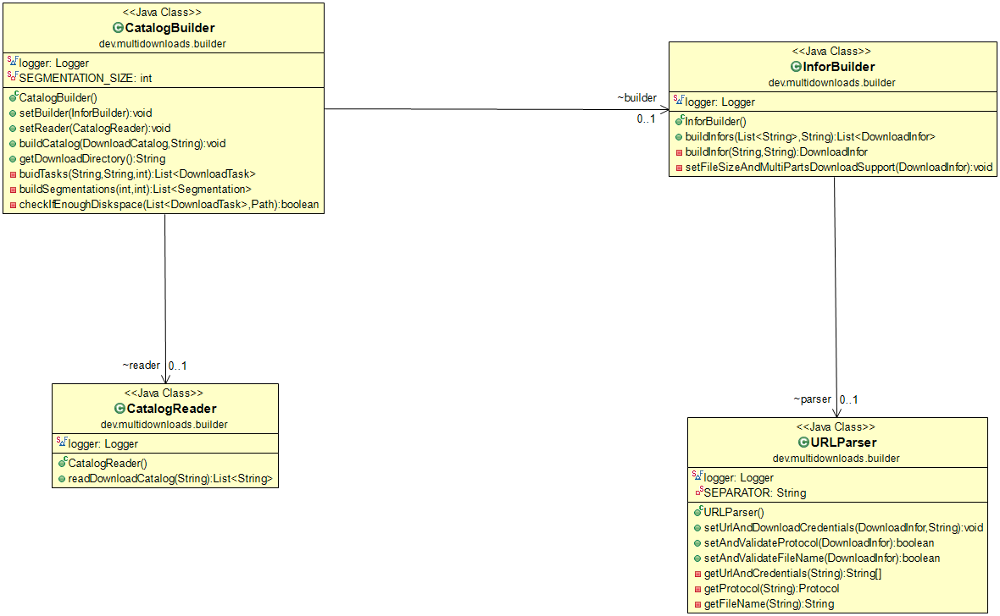

## Problem

Download in parallel multi files by splitting each file in multiple parts. Support multiple protocols and extendable. 

### Requirements
1. Download in parallel.
2. The program should extensible to support different protocols.
3. Some sources might very big (more than memory).
4. Some sources might be very slow, while others might be fast.
5. Some sources might fail in the middle of download.
6. We don't want to have partial data in the final location in any case.

### Design decisions

To implement the 1st requirement, we use a queue of tasks in which a fixed number of threads in a pool can process in parallel a batch of items. This pattern can be used to implement both functionalities:
* A catalog file is a collection of URLs which can be downloaded in parallel.
* A file can be viewed as an array of chunk which can be retrieved concurrently.

Note that point 2 depends on the support of remote server. For the HTTP server, it is the support of RANGE header. For the FTP server, it is the provision of the REST command.
In both protocols we need support that can seek to an arbitrary point in the remote file stream to start download a certain number of file.
However, if the server does not support multi-part download, we still can consider that the array contains one chunk, which needed to be served by 1 thread only.

See classes DownloadManager.java and DownloadWorker.java; they apply the same thread pool pattern which different subjects: DownloadCatalog and DownloadTask(File)
Although we can write less code, we prefer to have a fine-grained of models

To implement the 2nd requirement, we use a factory pattern. A factory class(DownloaderFactory.java) will initialize different downloader object depending on the given protocol. If we need to support a new protocol, 3 things need to be done:
* Extend enum Protocol
* Extend the switch ... case in DownloaderFactory
* Implement a downloader that should extend the Downloader class and implement the Callable interface. Any extra download parameters, e.g. certificate file for HTTPS should be populated in Download infor.

We also need to implement the same modifications for XXXProber classes. We needs those probers because before downloading we need to detect if the remote server supports multi-part download.
More important, we need to know the remote file size in order to:
* Determine the number of chunks and range of each chunk to be retrieve from the file
* Prepare an all zero local file to be written to. In the Java implementation, we omit this steep due to the semantics of the seek operation in random access file. See Java docs.

To implement the 3rd requirement, we sip the data in small buffers. See the transfer method of Downloader class. This is applicable even if we can not download a file in multi parts. We always open stream on both sides and copy data from the remote to local stream.
Please see the heap visualization when monitoring the application by Visual VM:



To implement the 4th requirement, we use a simple logic: Order the remote files by size so the smaller file to be retrieved first. It could have been modified to use download speed as the sort criteria; we probe the remote resource before anyway so we may measure the download time of the sample.
However, the important thing to note is we do not need to wait for the slowest download to finish before moving to the next. Due to the design of threadpool (in this case Java executor service), one a thread finishes its task, it can be scheduled to pick up the next item in the queue.
Please note that in the global scope, we still have to wait for all tasks to finish to know if the download of all URLs is completed successfully.

To implement the 5th requirement, we have to make sure that threads serving task will never be in the deadlock state. To do so in the implementation, we make sure:
* Set time out parameter for the network activities so the thread will not wait forever, e.g. to response to server's login challenge.
* Catch all exceptions and handler them
* Make sure there would be no deadlock situation for the shared resource. In the current implementation, there are 2 kinds of the share resources:
    a. Update progress listener: Access to the common function to print out the progress is synchronized
	b. Multiple download sockets can write to the same local file: However, their destinations are not overlapped and we rely on the OS to synchronize access to the file. If the OS does not support concurrent write to file, we could have implemented Producer-Consumer pattern.
	   Writers (sockets) write to a circular buffer queues while 1 reader read from the queue and write to file. Be careful to select the size of the buffer. It should be fit in the memory, meanwhile we need to synchronize the read/write speed to avoid overflow buffer.
	   
There is 1 issue with the current implementation. If downloading of 1 file chunk fails, all the other chunks in the queue still be processed continuously. They will all likely to be failed because the same reason as the failed chunk: lost network connectivity for example.
We need some more sophisticated framework in which a thread when fails its execution can notify the pool manager to remove all items still waiting to be processed in the queue.

To implement the 6th requirement, we allows downloading the whole catalog could be retried a few times. As we view the download job is the composition of the smaller tasks, we remove the finished taskes from the collection and retain the aborted one after each run.
As long as we can make sure that the download thread will never been in deadlock stituation, we always can delete the corrupted file eventually. 	   

### Class diagram

The application includes 4 groups:

* Model:

To model the fact that we split any task into smaller jobs that can be solved in parallel.



* Download workers:

They are all use thread pool (Executor service).



* Downloaders:

They are generated by a factory so the list of the supported protocols is extendable.



* Builders:

For populating model. They use dependency injection for the unit testing purpose.




### Installation

Prerequisitions:
 
1. Java JDK version at least 1.7
2. Windows OS
3. Eclipse SDK
4. Maven

Compilation:

Output file is multidownloads-0.0.2-SNAPSHOT.jar (The version number can be changed in the pom.xml)
```
    mvn clean install -DskipTests
```

Test:
```
    mvn clean install test
```

Run the application:

Create a catalog.txt file and put it in the same directory with the Jar file (not a mandatory):
```
java -cp multidownloads-0.0.2-SNAPSHOT.jar dev.multidownloads.MainApp
Enter full path of the catalog file (Use ./ if the catalog file is in the same folder with the JAR file):
./catalog.txt
```

Notes:

1. The application will print the log message to both console and C:\logs
2. The config parameters should be put in a file config.properties
   The download directory string should escape the file path separator charactor
   If no config file is provided, the application will use the default settings hard-coded
3. To run the application, the Jar file, config.properties and optionally the catalog.txt files should be in the same folder, e.g. target
4. No binary should be committed to SVN, however, for the quict demo, the Jar file is committed   

### License

Free
